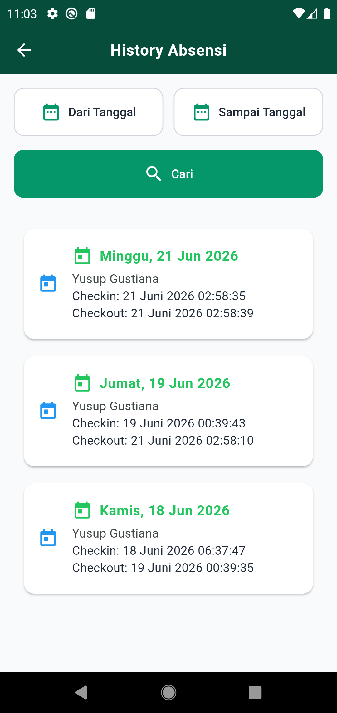
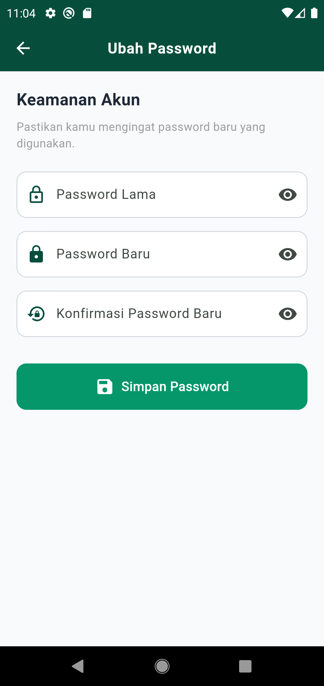
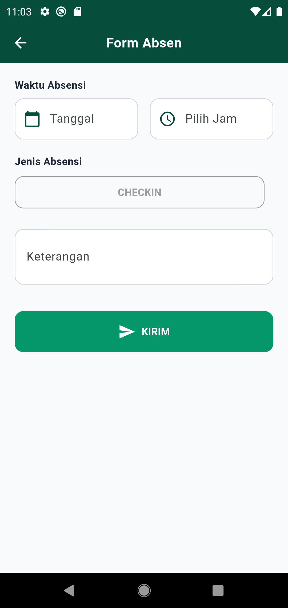
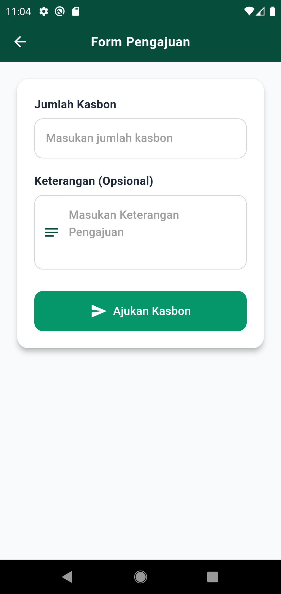
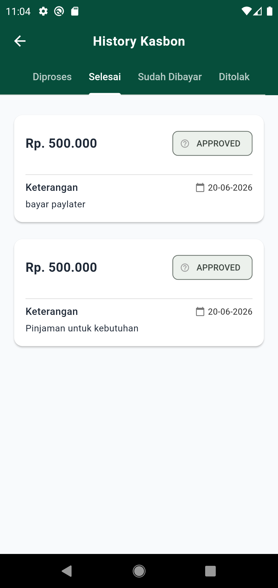

<h2>Screenshots</h2>

<table>
<tr>
<td>

</td>

<td>

</td>

<td>

</td>
</tr>

<tr>
<td align="center">
Login
</td>

<td align="center">
Home
</td>

<td align="center">
Absensi
</td>
</tr>

<tr>
<td>

</td>

<td>

</td>

<td>

</td>
</tr>

<tr>
<td align="center">
History
</td>

<td align="center">
Settings
</td>

<td align="center">
Change Password
</td>
</tr>

<tr>
<td>

</td>

<td>

</td>

<td>

</td>
</tr>

<tr>
<td align="center">
Form Absensi
</td>

<td align="center">
Form Kasbon
</td>

<td align="center">
History Kasbon
</td>
</tr>

</table>
